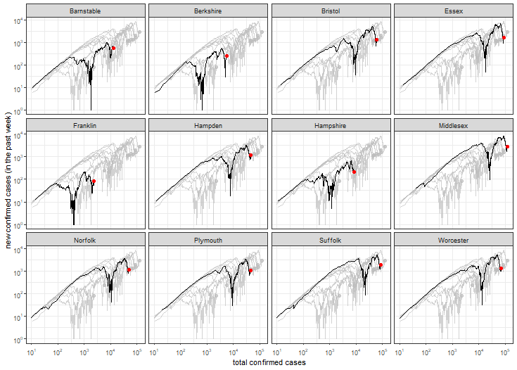

```{r setup, include = FALSE}
  knitr::opts_chunk$set(echo = FALSE)

# load libraries
library(dplyr)
```

```{r header, results = 'asis'}
cat(paste0("# Trends in COVID-19 for counties in the U.S. state of Massachusetts (updated on ", params$date, ")\n"))
```



```{r county, results = 'asis'}
# ma counties
ma_counties = c('Barnstable', 'Berkshire', 'Bristol', 'Essex', 'Franklin', 'Hampden', 'Hampshire', 'Middlesex', 'Norfolk', 'Plymouth', 'Suffolk', 'Worcester')

# load cdc community level data
cdc_ma = read.csv('./data/cdc-community-ma-counties.csv', header = TRUE)

# function to print out md
md_txt = function(i) {
  
    # filter data for county
    cty_cdc = cdc_ma %>% filter(county == paste0(i, ' County, MA')) %>% pull(covid.19_community_level)
    
    # date updated
    cty_date = cdc_ma %>% filter(county == paste0(i, ' County, MA')) %>% pull(date_updated)
    
    # set color based on community level
    cty_level = case_when(cty_cdc == 'Low' ~ 'success', 
                          cty_cdc == 'Medium' ~ 'important',
                          cty_cdc == 'High' ~ 'critical')
    
    # md text
    paste0(
      '## ', i, ' County\n', 
      ' on ', cty_date,
      '\n\n',
      '| Log  | Linear |\n',
      '| ------------- | ------------- |\n',
      '| , '_county_covid_log.png) | , '_county_covid_linear.png) |\n\n'
    )
  
}

# loop through 
for(i in ma_counties) cat(md_txt(i))
```