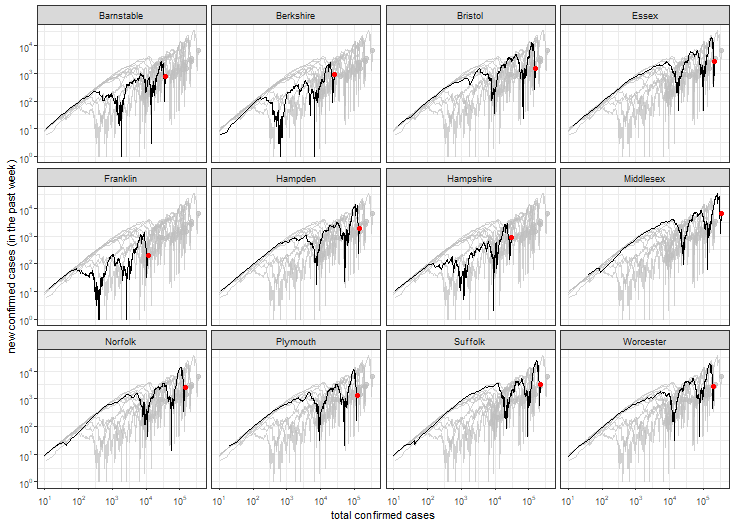

```{r setup, include = FALSE}
  knitr::opts_chunk$set(echo = FALSE)
```

```{r header, results = 'asis'}
cat(paste0("# Trends in COVID-19 for counties in the U.S. state of Massachusetts (updated on ", params$date, ")\n"))
```



## Bristol County

| Log        | Linear           | 
|  |  |

## Credits

Data on COVID-19 provided by The New York Times. Many thanks to the New York Times for making this invaluable resource publicly available! Inspiration for this example was taken from [MinutePhysics](https://www.youtube.com/watch?v=54XLXg4fYsc) and [Aatish Bhatia](http://aatishb.com/covidtrends/).