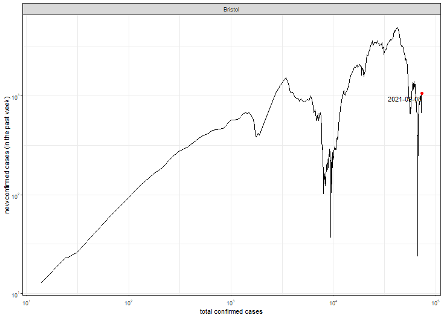
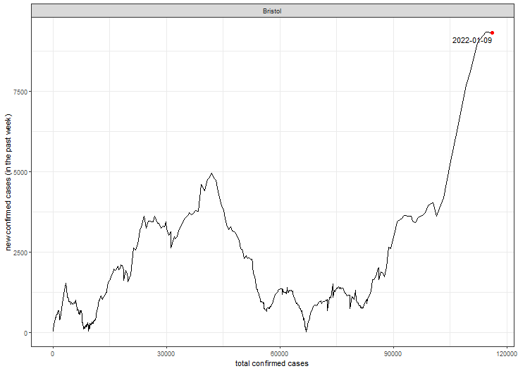

Trends in COVID-19 for counties in the U.S. state of Massachusetts (updated on 2021-09-01)
==========================================================================================

Bristol County
--------------

<table>
<colgroup>
<col style="width: 50%" />
<col style="width: 50%" />
</colgroup>
<thead>
<tr class="header">
<th>Log</th>
<th>Linear</th>
</tr>
</thead>
<tbody>
<tr class="odd">
<td></td>
<td></td>
</tr>
</tbody>
</table>

Credits
-------

Data on COVID-19 provided by The New York Times. Many thanks to the New
York Times for making this invaluable resource publicly available!
Inspiration for this example was taken from
[MinutePhysics](https://www.youtube.com/watch?v=54XLXg4fYsc) and [Aatish
Bhatia](http://aatishb.com/covidtrends/).
