# Trends in COVID-19 for counties in the U.S. state of Massachusetts (updated on 2022-03-11)

## Barnstable County

<table>
<colgroup>
<col style="width: 50%" />
<col style="width: 50%" />
</colgroup>
<thead>
<tr class="header">
<th>Log</th>
<th>Linear</th>
</tr>
</thead>
<tbody>
<tr class="odd">
<td>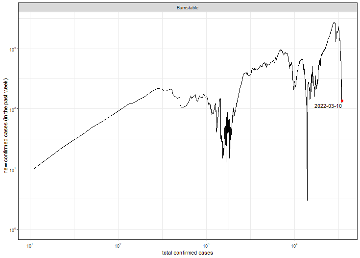</td>
<td>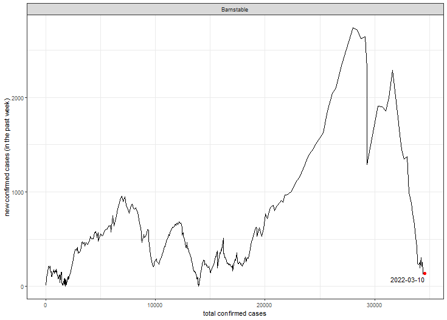</td>
</tr>
</tbody>
</table>

## Berkshire County

<table>
<colgroup>
<col style="width: 50%" />
<col style="width: 50%" />
</colgroup>
<thead>
<tr class="header">
<th>Log</th>
<th>Linear</th>
</tr>
</thead>
<tbody>
<tr class="odd">
<td>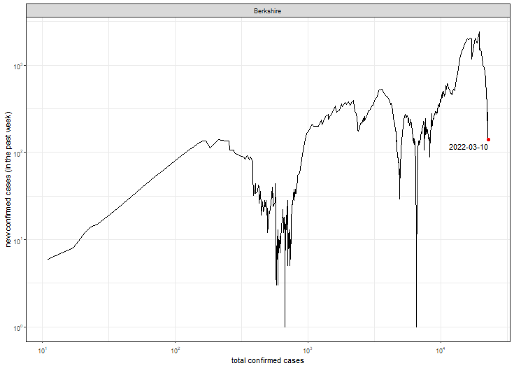</td>
<td>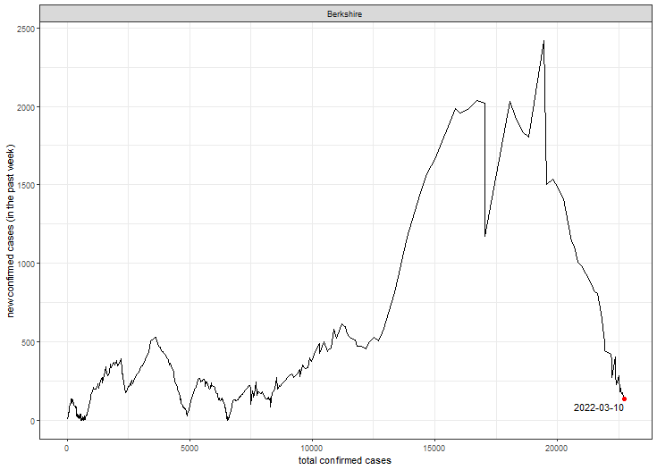</td>
</tr>
</tbody>
</table>

## Bristol County

<table>
<colgroup>
<col style="width: 50%" />
<col style="width: 50%" />
</colgroup>
<thead>
<tr class="header">
<th>Log</th>
<th>Linear</th>
</tr>
</thead>
<tbody>
<tr class="odd">
<td></td>
<td></td>
</tr>
</tbody>
</table>

## Essex County

<table>
<colgroup>
<col style="width: 50%" />
<col style="width: 50%" />
</colgroup>
<thead>
<tr class="header">
<th>Log</th>
<th>Linear</th>
</tr>
</thead>
<tbody>
<tr class="odd">
<td>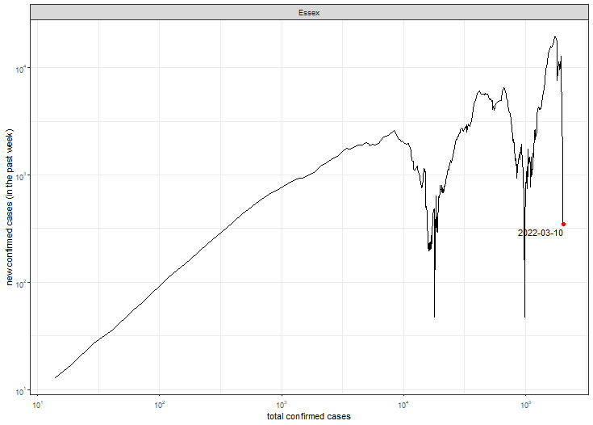</td>
<td>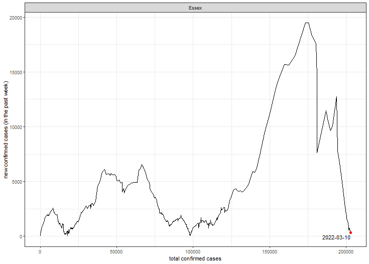</td>
</tr>
</tbody>
</table>

## Franklin County

<table>
<colgroup>
<col style="width: 50%" />
<col style="width: 50%" />
</colgroup>
<thead>
<tr class="header">
<th>Log</th>
<th>Linear</th>
</tr>
</thead>
<tbody>
<tr class="odd">
<td>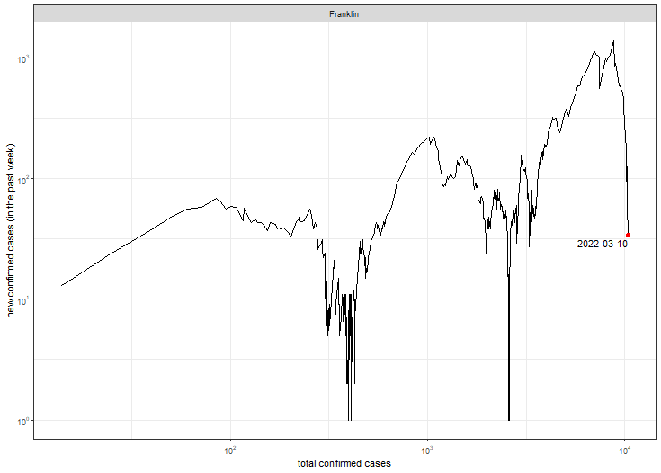</td>
<td>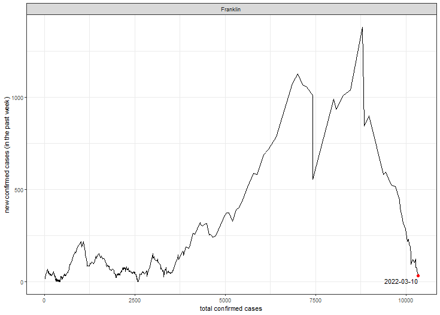</td>
</tr>
</tbody>
</table>

## Hampden County

<table>
<colgroup>
<col style="width: 50%" />
<col style="width: 50%" />
</colgroup>
<thead>
<tr class="header">
<th>Log</th>
<th>Linear</th>
</tr>
</thead>
<tbody>
<tr class="odd">
<td>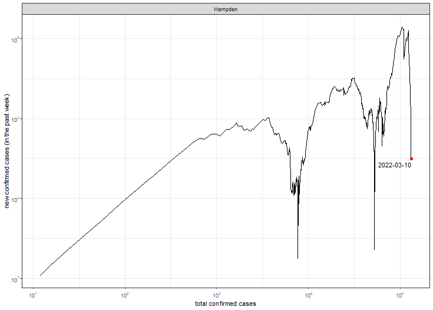</td>
<td>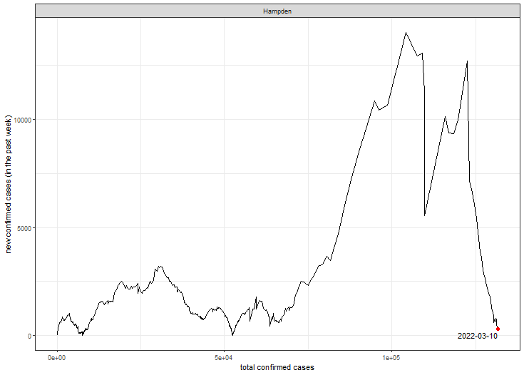</td>
</tr>
</tbody>
</table>

## Hampshire County

<table>
<colgroup>
<col style="width: 50%" />
<col style="width: 50%" />
</colgroup>
<thead>
<tr class="header">
<th>Log</th>
<th>Linear</th>
</tr>
</thead>
<tbody>
<tr class="odd">
<td>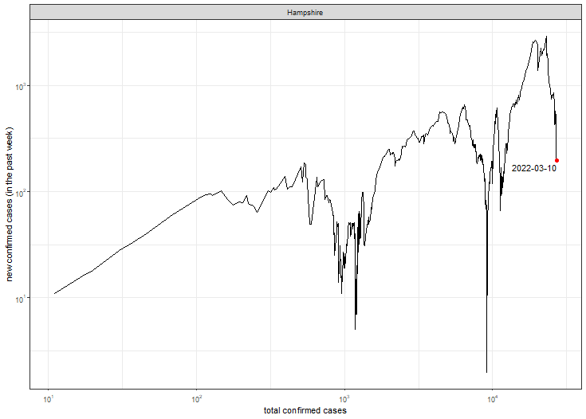</td>
<td>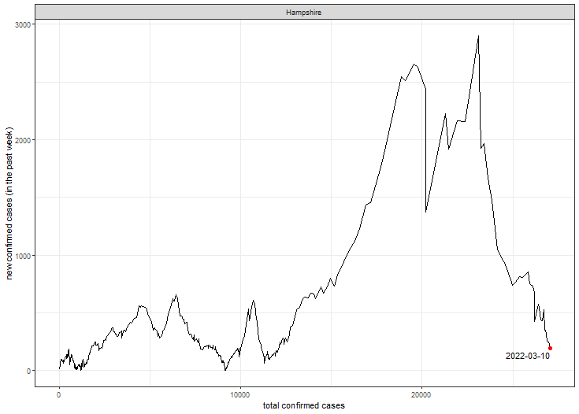</td>
</tr>
</tbody>
</table>

## Middlesex County

<table>
<colgroup>
<col style="width: 50%" />
<col style="width: 50%" />
</colgroup>
<thead>
<tr class="header">
<th>Log</th>
<th>Linear</th>
</tr>
</thead>
<tbody>
<tr class="odd">
<td>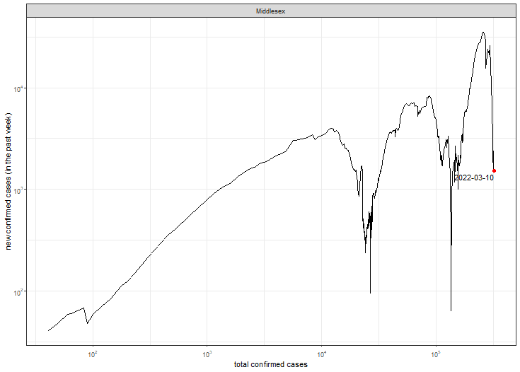</td>
<td>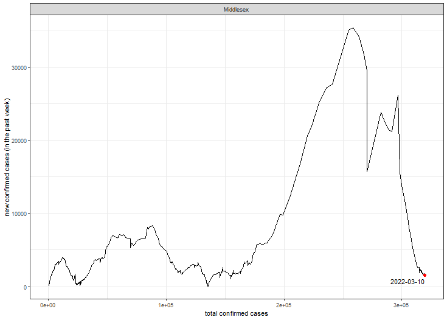</td>
</tr>
</tbody>
</table>

## Norfolk County

<table>
<colgroup>
<col style="width: 50%" />
<col style="width: 50%" />
</colgroup>
<thead>
<tr class="header">
<th>Log</th>
<th>Linear</th>
</tr>
</thead>
<tbody>
<tr class="odd">
<td>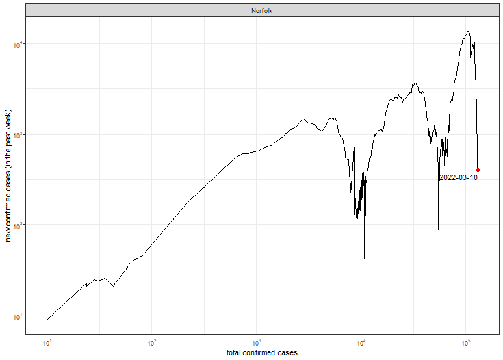</td>
<td>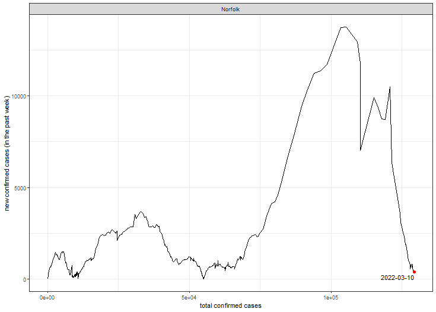</td>
</tr>
</tbody>
</table>

## Plymouth County

<table>
<colgroup>
<col style="width: 50%" />
<col style="width: 50%" />
</colgroup>
<thead>
<tr class="header">
<th>Log</th>
<th>Linear</th>
</tr>
</thead>
<tbody>
<tr class="odd">
<td>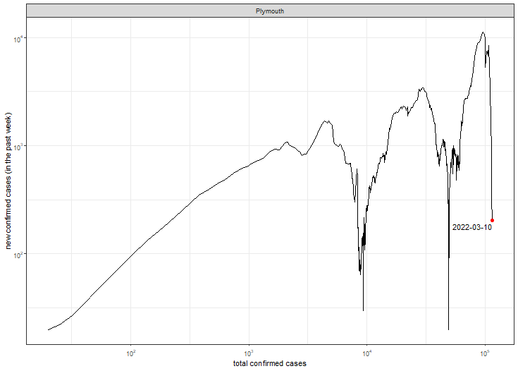</td>
<td>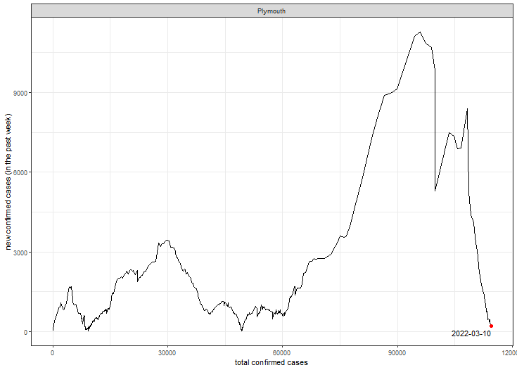</td>
</tr>
</tbody>
</table>

## Suffolk County

<table>
<colgroup>
<col style="width: 50%" />
<col style="width: 50%" />
</colgroup>
<thead>
<tr class="header">
<th>Log</th>
<th>Linear</th>
</tr>
</thead>
<tbody>
<tr class="odd">
<td>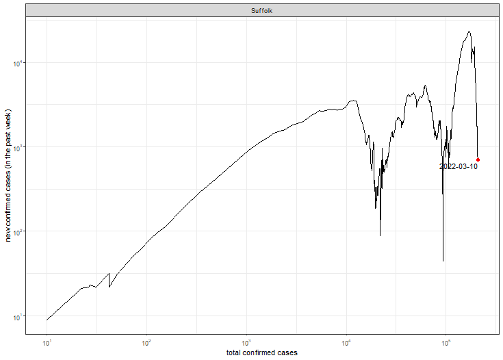</td>
<td>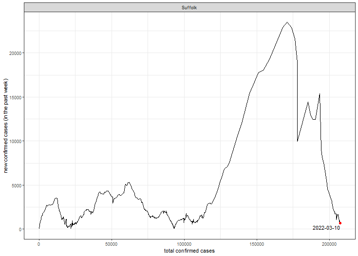</td>
</tr>
</tbody>
</table>

## Worcester County

<table>
<colgroup>
<col style="width: 50%" />
<col style="width: 50%" />
</colgroup>
<thead>
<tr class="header">
<th>Log</th>
<th>Linear</th>
</tr>
</thead>
<tbody>
<tr class="odd">
<td>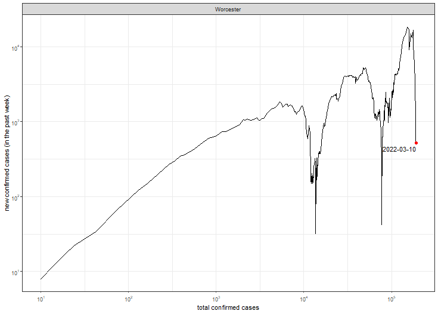</td>
<td></td>
</tr>
</tbody>
</table>
